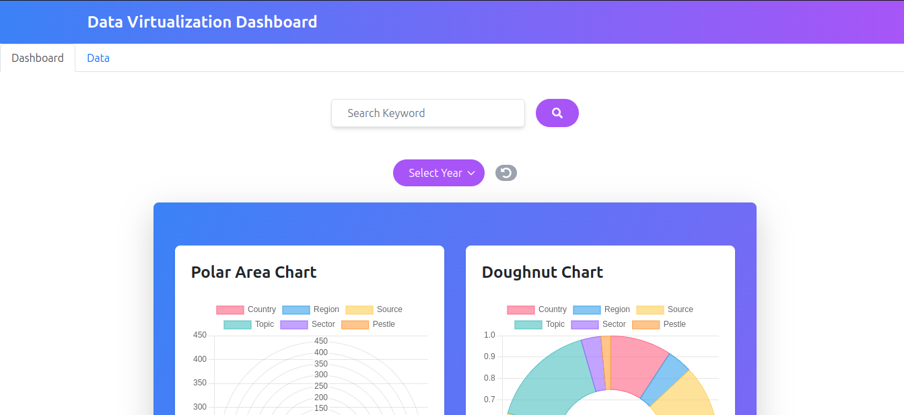
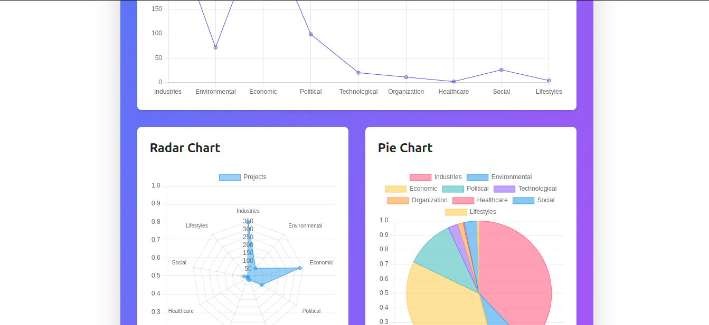
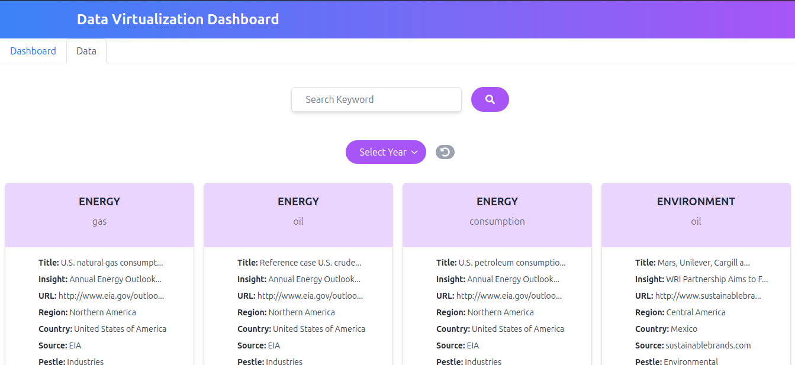

# This is DATA VISUALIZATION Dashboard built on MERN STACK

# DATA is FETCH FROM Backend which is saved on MONGODB and showed in Dashboard using react and tailwindcss

## Available Scripts

In the project directory, you can run:

### `npm i`

installs the node_modules.

### `npm run dev`

Concurrently Runs the frontend app in the development mode on (http://localhost:3000)\ 
Open [http://localhost:3000](http://localhost:3000) to view it in your browser.
And Runs the backend app on (http://localhost:4000)\ 

The page will reload when you make changes.
You may also see any lint errors in the console.

## Screen Shots

